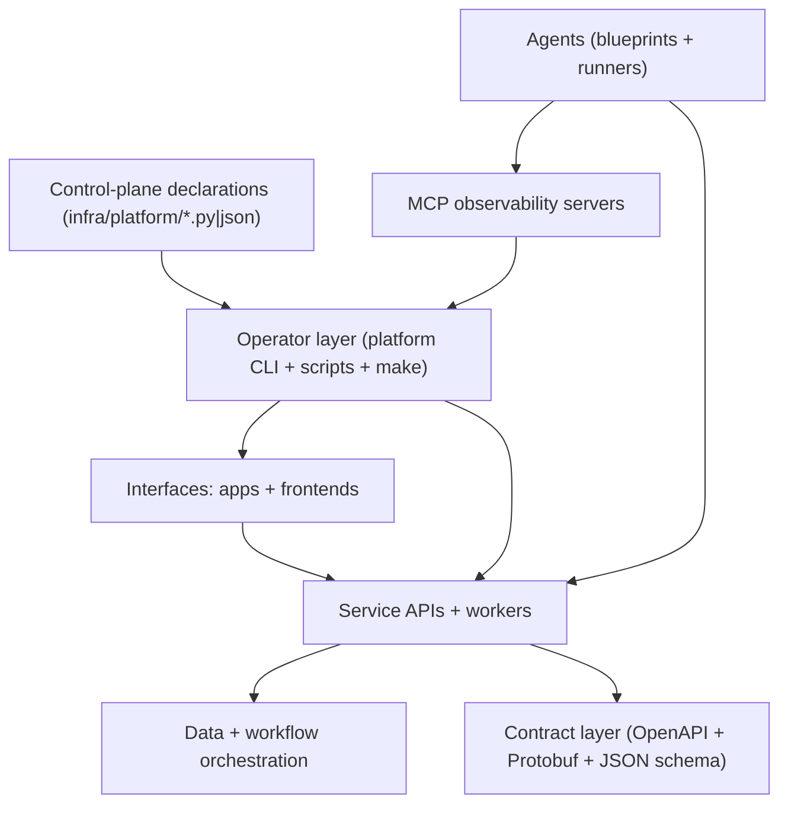

# Project X Repository Architecture Deep Dive

This document is a deep explanation of how the repository is organized, which tools it uses, how modules relate to each other, and how to operate it day-to-day.

Audience:
- New contributors onboarding to the monorepo.
- Engineers adding new services/apps/agents/contracts.
- Operators running local stack workflows and deployment automation.

## 1. What This Repository Is

Project X is a monorepo that combines:
- user-facing web surfaces,
- backend APIs/workers,
- agent workflows,
- shared SDK/contracts,
- platform operations tooling,
- infra/control-plane declarations.

The core idea is one repo with shared standards and reusable building blocks instead of disconnected per-project repositories.

## 2. Architecture Layers (Conceptual)



How to read this:
- `apps/` provide operator/product surfaces (frontends + backends colocated by feature).
- `protos/` + `schemas/` define contracts.
- `platform` + `platform-cli` + `scripts` operate local/dev/prod lifecycle.
- `infra/platform` defines desired project/integration/deploy state.
- `agents/` provides autonomous and assistive workflows.
- `mcp/` exposes provider observability through MCP tool servers.

## 3. Toolchain and Technologies Used

## Runtime languages

- TypeScript/Node.js (Next.js frontends, scripts, MCP servers, agent runners).
- Go (platform CLI, access-api, omnichannel backend/worker).
- Rust (`apps/x-stream-bot`, `cli`).
- Python (config materialization utility under `scripts/ci/`).
- Shell (`platform`, `scripts/*`, operational wrappers).

## Core frameworks/libraries by area

- Web apps: Next.js 16, React 19, Tailwind CSS 4, React Query, Zustand, Lucide.
- Command palette/UI primitives: `cmdk`, Radix select in frontends.
- Go services: Chi router, pgx/Postgres, Temporal SDK, ConnectRPC, JWT, Zap.
- MCP servers: Bun runtime, Hono web framework, Vercel SDK, GCP Logging/Monitoring SDKs.
- Rust services: Tokio async runtime, Reqwest HTTP, Clap CLI parsing, Tracing.
- Contract layer: Protobuf (`protos/*`), OpenAPI (`schemas/*`), JSON Schema (`schemas/agents/*`).

## Platform/operator tooling

- `./platform` wrapper script + `platform-cli` Go source.
- `make` orchestrates common tasks (`setup`, `test`, `build`, `stack-up`, etc.).
- `scripts/verify`, `scripts/doctor`, `scripts/dev-stack`, `scripts/deploy-preflight`.
- Supabase + Temporal used by omnichannel local stack workflows.

## 4. Module-by-Module Explanation

## Root-level control files

- `README.md`: broad architecture and mission overview.
- `AGENTS.md`: execution policy for agents/coding workflow.
- `PLANS.md`: rules for writing/updating ExecPlans.
- `Makefile`: top-level operator commands.
- `platform`: shell entrypoint that builds/runs Go CLI in `platform-cli`.
- `package.json`: workspace config and cross-repo npm scripts.
- `platform.projects*.json` + `platform.controlplane*.json`: project/deployment/control-plane config snapshots/examples.

## `apps/`

Primary product UI package currently present:
- `apps/cloud-console`: Next.js app shell for cloud/omnichannel operations.

What it does:
- Hosts admin/operator routes for notifications, templates, deployments, API keys, omnichannel operations, and bots.
- Shares navigation and UX patterns with `services/omnichannel/frontend` (mirrored shell behavior).

Key directories:
- `app/`: route handlers, pages, and shared UI components.
- `lib/`: frontend API clients and helpers.
- `docker/`: container/deploy support assets.

## `apps/` (folder-by-feature)

Each app is self-contained with its frontend, backend (if any), and deployment declarations.

### `apps/cloud-console`

Purpose:
- Web dashboard for service access and API key workflows.

### `apps/access-api`

Purpose:
- API key issuance, key lifecycle operations, and policy-check endpoint used by platform/app clients.

Key behavior:
- Exposes health, key mint/list/rotate/revoke, audit, and policy-check APIs.
- Uses Postgres via `pgx`.

Key paths:
- `cmd/api/main.go`: service entrypoint.
- `README.md`: endpoint/auth/config quick reference.

### `apps/omnichannel`

Purpose:
- Notification platform stack with API + worker + frontend + infra scripts.

Submodules:
- `backend/`: Go API + Temporal worker runtime.
- `frontend/`: Next.js operations surface (mirrors cloud-console patterns).
- `infra/`: docker/init assets.
- `scripts/`: stack helpers and SDK publishing helpers.
- `supabase/`: migrations and local DB-related artifacts.

Backend internals (high-level):
- `internal/api`: HTTP routes/middleware/handlers.
- `internal/repository`: data access.
- `internal/provider`: channel provider adapters (e.g., SendGrid, FCM).
- `internal/temporal`: workflows + activities.
- `internal/rpc`: ConnectRPC handlers/interceptors.

### `apps/x-stream-bot`

Purpose:
- Low-latency Rust bridge from X filtered stream events to downstream trading signal endpoint (`XAPI`).

Key behavior:
- Maintains stream connection.
- Parses events into normalized signal payloads.
- Forwards to live API when credentials exist; can run local-only.

## `agents/`

Purpose:
- Human-assist and autonomous workflows around planning, triage, and reporting.

Subareas:
- `agents/blueprints/`: contract-first blueprint definitions (`agent.json`, prompts, eval cases, verification script).
- `agents/code-agents/`: Linear issue routing into specialized agent profiles and brief generation.
- `agents/code-feature-agent`, `code-bugfix-agent`, `code-refactor-agent`: prompt profiles.
- `agents/pm-agent/`: daily PM health/digest runner with optional SMS/webhook integration.

Artifacts:
- Generated outputs land under `agents/*/out/` and are runtime artifacts, not architectural source-of-truth.

## `packages/`

Purpose:
- Shared libraries/SDKs intended for reuse.

Current notable packages:
- `packages/sdk-access`: lightweight TypeScript client for Access API.
- `packages/iac`: integration/types scaffolding for infra-related abstractions.

## `platform-cli/` and `platform`

Purpose:
- Unified operator CLI for stack lifecycle, token lifecycle, project/deploy/config workflows, and control-plane operations.

Design:
- `platform` script is a smart launcher:
  - uses `bin/platform` if built,
  - otherwise runs `go run` from `platform-cli`.
- `platform-cli/*.go` contains command modules (`stack`, `tokens`, `project`, `control-plane`, domains, notifications, docs helpers).

Why this matters:
- This is the preferred day-to-day runtime control entrypoint per runbook/policy.

## `scripts/`

Purpose:
- Lower-level automation and verification entrypoints used directly or behind `make`/`platform`.

Key scripts:
- `scripts/doctor`: local environment smoke checks.
- `scripts/verify`: multi-mode verification (platform/apps/docs/agents).
- `scripts/dev-stack`: process supervisor for local multi-service stack.
- `scripts/deploy-preflight`: pre-deploy checks.
- `scripts/ci/materialize_platform_configs.py`: declarative config materialization/check.
- `scripts/ci/generate-project-registry.mjs`: project and MCP registry generation.
- `scripts/new`: scaffolding helper for new modules.

## `infra/`

Purpose:
- Declarative platform/control-plane definitions and generated registry outputs.

Key files:
- `infra/platform/declarative_spec.py`: canonical declarative source.
- `infra/platform/integrations.overrides.json`: mutable integration overrides.
- generated outputs:
  - `infra/platform/deployments.generated.json`
  - `infra/platform/registry/projects.generated.json`
  - `infra/platform/mcp/servers.generated.json`

## `mcp/`

Purpose:
- MCP servers for observability integrations.

Current servers:
- `mcp/vercel-observability/server.ts`
- `mcp/gcp-observability/server.ts`

Shared transport helper:
- `mcp/common/mcp-stdio.ts`

Role in architecture:
- Provides tool endpoints for observability/audit workflows via MCP host integration.

## `protos/` and `schemas/`

Purpose:
- Contract/source-of-truth definitions for cross-module interfaces.

Current contract anchors:
- Protobuf: `protos/access/v1/access.proto`
- OpenAPI: `schemas/access-api/openapi.yaml`
- Agent schema: `schemas/agents/agent-blueprint.schema.json`

Usage:
- Drives consistency for clients, services, and agent contract validation.

## `docs/`

Purpose:
- Human-facing operational and architecture documentation.

Includes:
- runbooks,
- architecture notes,
- mintlify docs source,
- policy/mistake tracking docs.

## `plans/`

Purpose:
- Living execution plans (ExecPlans) for implementation tasks.

Governance:
- Structure and maintenance rules are defined in `PLANS.md`.

## `cli/`

Purpose:
- Rust CLI (`x_cli`) focused on omnichannel operations.

Use case:
- Alternative operational client for sending/listing/status checks on notifications via API key + API URL.

## `bin/`

Purpose:
- Compiled local binaries (for example `bin/platform`) produced by build workflows.

## 5. How Modules Interact (Operational Flows)

## Flow A: Notification dispatch (typical path)

1. User/operator triggers send from frontend (`apps/cloud-console` or `apps/omnichannel/frontend` routes).
2. Frontend calls omnichannel backend API.
3. Backend validates auth/scope and persists notification intent.
4. Temporal workflow/activity executes channel delivery path.
5. Provider adapter (email/app/push/etc.) delivers or relays.
6. Status/history visible in frontend status/deployments workflows.

## Flow B: API key and policy check

1. Operator or automation calls Access API key endpoints.
2. Access API stores key metadata/scope and returns secret material (where applicable).
3. Downstream services use issued key for scoped requests.
4. Policy checks happen through `/v1/policy/check`.
5. Audit logs provide lifecycle trail.

## Flow C: Local stack lifecycle

Preferred:
1. `./platform start`
2. `./platform status`
3. `./platform logs <service>`
4. `./platform stop`

Alternative supervisor mode:
- `scripts/dev-stack <start|status|logs|stop>`

## Flow D: Agent issue triage

1. `agents/code-agents/run.mjs` ingests issues (Linear API or JSON).
2. Router maps each issue to feature/bugfix/refactor profile.
3. Briefs are emitted into `agents/code-agents/out/briefs`.
4. Contributors/automation consume briefs for implementation execution.

## 6. Context and Conventions That Matter

- Platform CLI-first runtime policy: use `./platform ...` as default runtime control path.
- Build commands are compile validation, not runtime validation.
- Cloud console is the single frontend; omnichannel routes live at `/omnichannel` within it.
- Plans are required for task execution and must be kept current while work progresses.
- Linear ticketing, status sync, and follow-up scanning are mandatory process expectations (see `AGENTS.md`).

## 7. Day-to-Day Usage Guide

## Bootstrap and health checks

```bash
make setup
./platform status
scripts/doctor
```

## Validation paths

```bash
scripts/verify all
scripts/verify platform
scripts/verify apps
scripts/verify docs
scripts/verify agents
```

## Build paths

```bash
make build
./platform build
npm --prefix apps/cloud-console run build
```

## Stack lifecycle

```bash
./platform start
./platform status
./platform logs access-api
./platform stop
```

## 8. Source-of-Truth vs Generated Artifacts

Source-of-truth examples:
- `infra/platform/declarative_spec.py`
- `protos/*.proto`
- `schemas/**/*.yaml|json`
- service/app source directories

Generated/artifact examples:
- `infra/platform/*generated*.json`
- `agents/*/out/*`
- `bin/platform`
- local build/runtime folders (e.g., `.next`, `target`, `node_modules`)

Rule of thumb:
- Edit declarative/source files directly.
- Regenerate derived files using repo scripts when needed.

## 9. Extension Playbook (Where To Add New Things)

Add a new:
- UI app: `apps/<name>`
- backend service/worker: `apps/<name>/backend` or `apps/<name>`
- shared SDK/library: `packages/<name>`
- agent blueprint: `agents/blueprints/<agent-id>/`
- schema/contract: `schemas/` or `protos/`
- platform operator capability: `platform-cli/` + `platform`
- automation helper: `scripts/`
- observability MCP tool surface: `mcp/`
- architecture/runbook documentation: `docs/`
- execution plan for implementation: `plans/<task>.md`

## 10. Quick Orientation Checklist for New Contributors

1. Read `AGENTS.md`, `PLANS.md`, and this document.
2. Run `scripts/doctor`.
3. Start stack with `./platform start` and verify with `./platform status`.
4. Review `README.md` plus the specific module README you will touch.
5. Create/update an ExecPlan in `plans/` and sync the corresponding Linear issue.

